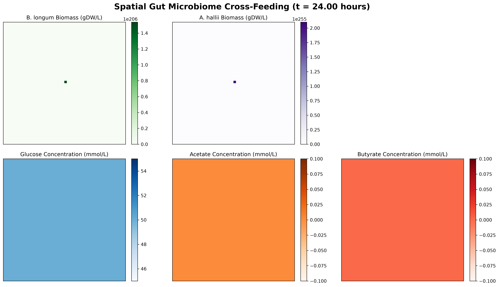

# 🦠 Spatial Gut Microbiome dFBA Pipeline

Hi! This is a computational biology project I built to model how different bacteria in the human gut interact and share nutrients across space and time. 

Specifically, it uses **2D spatial dynamic Flux Balance Analysis (dFBA)** to simulate cross-feeding between two real gut bacteria using their genome-scale metabolic models (GSMMs from AGORA2).

## What's actually happening here?
I wanted to see what happens when bacteria have to physically share space and resources instead of just living in a well-mixed liquid. I modeled a classic cross-feeding relationship:
* ***Bifidobacterium longum*:** Eats dietary carbs (glucose) and produces acetate.
* ***Anaerobutyricum hallii*:** Relies on the acetate from *B. longum* to produce **butyrate**, a short-chain fatty acid that is super important for human intestinal health.

The code places them on a 2D grid. The bacteria have to grow, consume metabolites, and rely on physical diffusion to survive, governed by Michaelis-Menten kinetics.

## Code Structure
* `spatial_pde.py` - The 2D reaction-diffusion solver. This handles how the metabolites drift across the grid using finite difference methods.
* `dfba_engine.py` - The core engine that hooks into COBRApy to calculate how fast the bacteria are growing at each time step.
* `run_sensitivity.py` - A parallelized Global Sensitivity Analysis (LHS + PRCC) script to test what variables actually control the system.
* `main.py` & `visualizer.py` - Runs the simulation and generates the heatmaps.

## My Findings So Far 📊
I ran a sensitivity analysis (200+ parallel simulations) to see what drives butyrate production the most: is it how fast the enzymes work (Vmax), or just how many bacteria are there at the start?

The PRCC results showed that **initial population density matters way more than absolute enzyme speed**. Basically, in a nutrient-rich gut environment, physical proximity and getting a "head start" on colonization is the biggest bottleneck for cross-feeding efficiency. 

## How to Run It
If you want to test this out locally:
1. Clone this repo and install the dependencies (`cobra`, `scipy`, `numpy`, `pandas`, `matplotlib`).
2. Run `test_growth.py` to make sure the individual biological models are working.
3. Run `python main.py` to run the 2D spatial simulation and generate your own heatmaps!
4. Run `python run_sensitivity.py` to run the parallel sensitivity analysis (warning: this will max out your CPU threads for a minute).